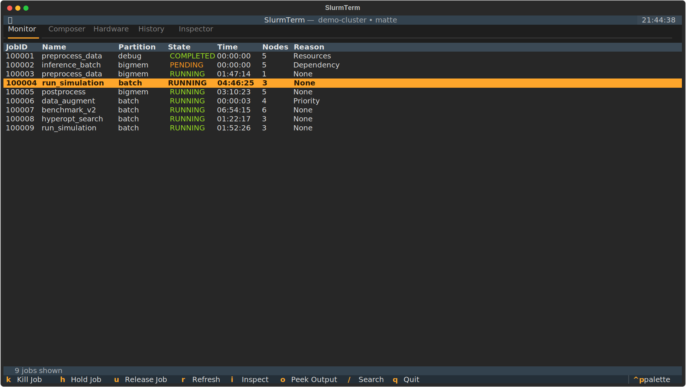
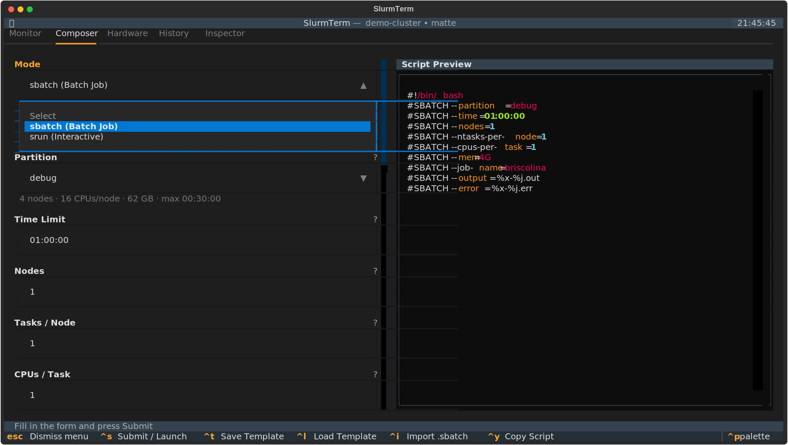

# SlurmTerm

A keyboard-driven Terminal User Interface for the [Slurm](https://slurm.schedmd.com/) workload manager, built with [Textual](https://textual.textualize.io/).

Monitor jobs, compose batch scripts or interactive sessions, explore cluster hardware, and inspect running jobs with real-time metrics, all without leaving your terminal.

<p align="center">
  
</p>

<p align="center">
  
</p>

## Installation

```bash
pip install slurm-term
```

Requires Python 3.10+ and a working Slurm installation on the target machine.

### Development

```bash
git clone https://github.com/22cav/slurm-term.git
cd slurm-term
pip install -e ".[dev]"
```

## Usage

```bash
slurm-term              # on a Slurm login node
slurm-term --demo       # simulated cluster (no Slurm required)
```

The `--demo` flag launches a self-contained simulation with fake jobs, partitions, and log output. Useful for exploring the interface or developing locally without access to a cluster.

## Key Bindings

| Key | Action |
| --- | --- |
| `q` | Quit |
| `1`–`5` | Switch tab: Monitor / Composer / Hardware / History / Inspector |
| `r` | Refresh current view |
| `k` | Cancel selected job (with confirmation) |
| `h` / `u` | Hold / release selected job |
| `Enter` | Inspect selected job (Monitor and History) |
| `Escape` | Return to Monitor from Inspector |
| `Ctrl+S` | Submit job (sbatch) or launch interactive session (srun) |
| `Ctrl+T` | Save template (Composer) |
| `Ctrl+L` | Load template (Composer) |

## Tabs

### 1. Monitor

Auto-refreshing job queue with color-coded states. Cancel, hold, and release jobs directly from the table.

### 2. Composer

Unified job submission form with a mode toggle at the top:

- **sbatch mode** — Full batch script builder with live preview: job name, script path, output/error patterns, module loads, environment variables, init commands.
- **srun mode** — Interactive session launcher: configures resources, then suspends the TUI and drops you into an allocated shell.

Core resource fields are always visible: partition, time limit, nodes, tasks per node, CPUs per task, memory, GPUs.

The **Add Parameter** button opens a searchable catalog of 30+ additional Slurm options, each with built-in documentation. Inline validation highlights invalid fields as you type. Templates can be saved and loaded for repeated workflows.

### 3. Hardware

Cluster overview with two sub-tabs:

- **Partitions**: availability, time limits, node counts, CPUs, memory (GB), GRES
- **Nodes**: per-node state, CPU count, memory (GB), free memory (GB), GRES, load

### 4. History

Completed job accounting from `sacct` (last 7 days). Displays elapsed time, CPU usage, peak memory, and exit codes. Press `Enter` to inspect a completed job.

### 5. Inspector

Visual job inspector with:

- Colored status badge in header
- Two-column metadata grid (partition, user, submit time, working directory, nodes, log paths)
- Resource summary (nodes, CPUs, memory, GRES)
- Live stdout/stderr log tailing
- Real-time CPU, memory, and GPU utilization charts

Select a job in Monitor or History and press `Enter` to inspect. Press `Escape` to return.

## Project Structure

```
slurm_term/
├── main.py                 # App entry point
├── slurm_api.py            # Safe Slurm CLI wrappers
├── mock_slurm.py           # Simulated cluster for --demo
├── layout.css              # Textual stylesheet
├── py.typed                # PEP 561 type marker
├── screens/
│   ├── monitor.py          # Queue table
│   ├── composer.py         # Unified sbatch/srun form
│   ├── add_param_screen.py # Parameter catalog modal
│   ├── param_catalog.py    # Slurm parameter documentation
│   ├── hardware.py         # Cluster hardware info
│   ├── history.py          # Completed job accounting
│   ├── inspector.py        # Job inspector with log tail and charts
│   ├── templates.py        # Save/load job templates
│   └── confirm.py          # Confirmation modal
└── utils/
    ├── validators.py       # Input validation
    └── formatting.py       # Rich text helpers
```

## Safety

All Slurm commands use `subprocess.run` with list arguments — no shell interpolation. Job IDs, parameter keys, parameter values, and job names are validated before use. User-controlled strings are escaped before rendering. Template names are sanitized to prevent path traversal.

## Testing

```bash
python -m pytest tests/ -v
```

All tests run without a Slurm installation.

## License

MIT
