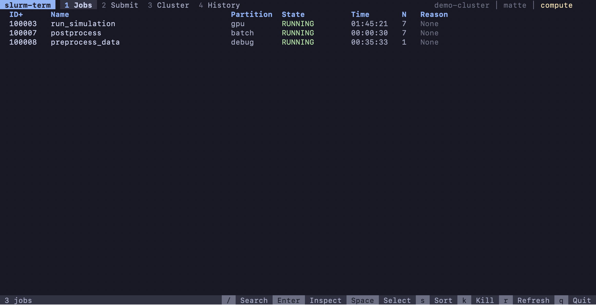
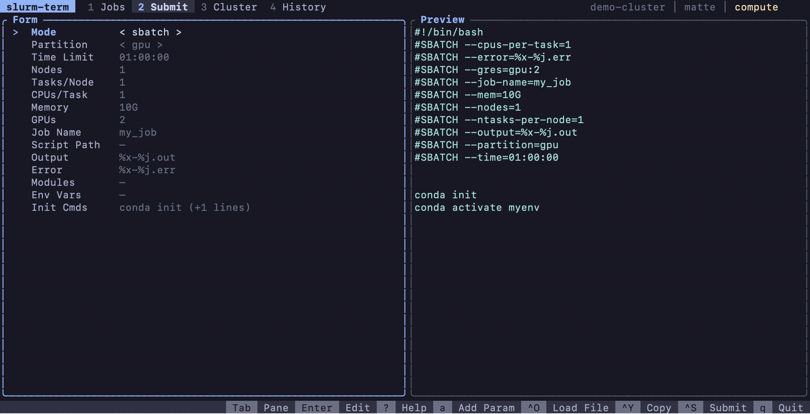

# slurm-term

A keyboard-driven Terminal User Interface for the [Slurm](https://slurm.schedmd.com/) workload manager.

Monitor jobs, compose batch scripts or interactive sessions, explore cluster hardware, and browse job history — all without leaving your terminal.

> From **v0.1.4**: Rewritten in Rust for instant startup, zero runtime dependencies, and a single static binary.




## Features

- **Jobs** — Live job queue with search, selection, bulk cancel/hold/release, and inline inspection
- **Submit** — Interactive job composer with form + preview pane, input validation, parameter catalog with docs (`?`), and `.sbatch` file loading (`Ctrl+O`)
- **Cluster** — Partition and node hardware overview
- **History** — Completed job history with configurable time window
- **Mouse support** — Click to navigate tabs, select jobs, and interact with the form
- **Templates** — Save and load job templates (`Ctrl+T` / `Ctrl+L`)

## Installation

### From PyPI

```sh
pip install slurm-term
```

### From crates.io

```sh
cargo install slurm-term
```

### From source

```sh
git clone https://github.com/22cav/slurm-term.git
cd slurm-term
cargo build --release
# Binary at target/release/slurm-term
```

## Usage

```sh
# Run on a system with Slurm installed
slurm-term

# Load a .sbatch file on startup
slurm-term --file job.sbatch

# Demo mode (mock data, no Slurm required)
slurm-term --demo

# Custom history window
slurm-term --since now-14days
```

## Key Bindings

### Global

| Key     | Action          |
|---------|-----------------|
| `1-4`   | Switch tab      |
| `q`     | Quit            |
| `Ctrl+C`| Force quit      |

### Jobs (Monitor)

| Key     | Action          |
|---------|-----------------|
| `/`     | Search          |
| `Enter` | Inspect job     |
| `Space` | Select job      |
| `k`     | Kill selected   |
| `r`     | Refresh         |

### Submit (Composer)

| Key      | Action                    |
|----------|---------------------------|
| `Tab`    | Switch form/preview pane  |
| `Enter`  | Edit field                |
| `Arrow keys` | Navigate / edit cursor  |
| `?`      | Parameter help            |
| `a`      | Add extra parameter       |
| `d`      | Delete extra parameter    |
| `Ctrl+O` | Load .sbatch file         |
| `Ctrl+S` | Submit job                |
| `Ctrl+T` | Save template             |
| `Ctrl+L` | Load template             |

### Cluster (Hardware)

| Key     | Action          |
|---------|-----------------|
| `Tab`   | Switch view     |
| `r`     | Refresh         |

### History

| Key     | Action          |
|---------|-----------------|
| `Enter` | Inspect job     |
| `</>`  | Change time window |
| `r`     | Refresh         |

## Configuration

Configuration is read from `~/.config/slurmterm/config.toml`:

```toml
[poll]
monitor = 3.0
hardware = 30.0
history = 60.0

[general]
history_window = "now-7days"
```

Override the config path with `SLURMTERM_CONFIG=/path/to/config.toml`.

## License

MIT
