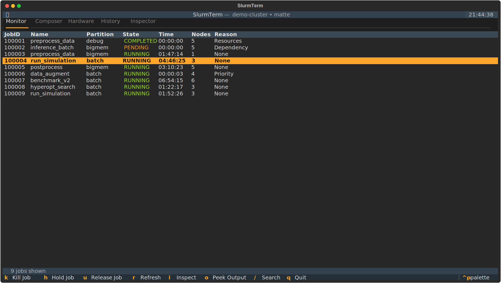
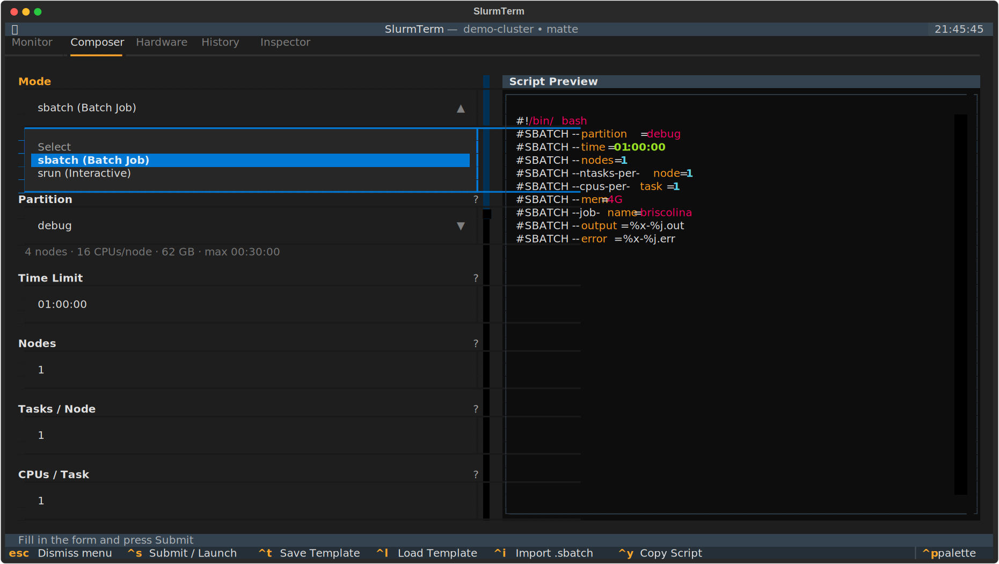

# SlurmTerm

A keyboard-driven Terminal User Interface for the [Slurm](https://slurm.schedmd.com/) workload manager, built with [Textual](https://textual.textualize.io/).

Monitor jobs, compose batch scripts or interactive sessions, explore cluster hardware, and inspect running jobs with real-time metrics, all without leaving your terminal.

<p align="center">
  
</p>

<p align="center">
  
</p>

## Installation

```bash
pip install slurm-term
```

Requires Python 3.10+ and a working Slurm installation on the target machine.

### Development

```bash
git clone https://github.com/22cav/slurm-term.git
cd slurm-term
pip install -e ".[dev]"
```

## Usage

```bash
slurm-term              # on a Slurm login node
slurm-term --demo       # simulated cluster (no Slurm required)
slurm-term --since now-3days   # set initial history window
slurm-term --version    # print version and exit
```

The `--demo` flag launches a self-contained simulation with fake jobs, partitions, and log output. Useful for exploring the interface or developing locally without access to a cluster.

The `--since` flag overrides the initial time window used by the History tab (default: `now-7days`).

## Key Bindings

### Global

| Key      | Action                                                          |
| -------- | --------------------------------------------------------------- |
| `q`      | Quit                                                            |
| `1`–`5`  | Switch tab: Monitor / Composer / Hardware / History / Inspector |
| `Ctrl+R` | Reload configuration from disk                                  |

### Monitor

| Key            | Action                                     |
| -------------- | ------------------------------------------ |
| `r`            | Refresh queue                              |
| `/`            | Search / filter jobs                       |
| `Space`        | Toggle select job                          |
| `Ctrl+A`       | Select / deselect all visible jobs         |
| `k`            | Cancel selected job(s) (with confirmation) |
| `h` / `u`      | Hold / release selected job(s)             |
| `i` or `Enter` | Inspect selected job                       |
| `o`            | Peek at job output (last 50 lines)         |
| `Escape`       | Clear selection, then clear search         |

### Composer

| Key      | Action                                                   |
| -------- | -------------------------------------------------------- |
| `Ctrl+S` | Submit job (sbatch) or launch interactive session (srun) |
| `Ctrl+T` | Save template                                            |
| `Ctrl+L` | Load template                                            |
| `Ctrl+I` | Import `.sbatch` file                                    |
| `Ctrl+Y` | Copy script preview                                      |

### History

| Key            | Action                |
| -------------- | --------------------- |
| `r`            | Refresh               |
| `i` or `Enter` | Inspect selected job  |
| `s`            | Resubmit selected job |

### Inspector

| Key      | Action                                        |
| -------- | --------------------------------------------- |
| `Escape` | Return to Monitor                             |
| `s`      | Resubmit current job (pre-populates Composer) |
| `e`      | Toggle between stdout and stderr log streams  |

## Tabs

### 1. Monitor

Auto-refreshing job queue with color-coded states. Cancel, hold, and release jobs directly from the table. Supports multi-select (`Space` / `Ctrl+A`) for bulk actions.

A searchable filter bar (`/`) lets you narrow the queue by job ID, name, state, or partition. The status bar shows job counts and selection state.

Press `o` to quick-peek the last 50 lines of a job's output file in a read-only modal. Press `Enter` to open the full Inspector.

Job state change notifications (completion, failure) can be enabled via configuration.

### 2. Composer

Unified job submission form with a mode toggle at the top:

- **sbatch mode** — Full batch script builder with live preview: job name, script path, output/error patterns, module loads, environment variables, init commands.
- **srun mode** — Interactive session launcher: configures resources, then suspends the TUI and drops you into an allocated shell.

Core resource fields are always visible: partition (with inline resource summary), time limit, nodes, tasks per node, CPUs per task, memory, GPUs.

The **Add Parameter** button opens a searchable catalog of 30+ additional Slurm options, each with built-in documentation. Inline validation highlights invalid fields as you type. Templates can be saved and loaded for repeated workflows.

**Import `.sbatch`** (`Ctrl+I`) parses an existing batch script and populates the form — including `#SBATCH` directives, `module load` lines, `export` lines, and init commands. Unrecognised directives are added as extra parameters.

Five default templates (Quick CPU Job, Multi-Node MPI, Single GPU Training, Large Memory Job, Interactive Session) are seeded on first run.

After a successful submission the app auto-switches to the Monitor tab.

### 3. Hardware

Cluster overview with two sub-tabs:

- **Partitions**: availability, time limits, node counts, CPUs, memory (GB), GRES
- **Nodes**: per-node state, CPU count, memory (GB), free memory (GB), GRES, load

### 4. History

Completed job accounting from `sacct`. Displays elapsed time, CPU usage, peak memory, and exit codes. A time window selector lets you choose from 1 to 30 days (or set the default via `--since` or config). Press `Enter` to inspect a completed job, or `s` to resubmit it.

### 5. Inspector

Visual job inspector with three sub-tabs:

- **Overview**: colored status badge, two-column metadata grid (partition, user, submit time, working directory, nodes), resource summary (nodes, CPUs, memory, GRES), and a time remaining progress bar.
- **Output & Error Logs**: log file paths display with live stdout tailing. Press `e` to toggle between stdout and stderr.
- **Live Metrics**: real-time CPU, memory, and GPU utilization charts (rolling 60-point window).

Press `s` to resubmit the current job — its parameters are extracted and loaded into the Composer.

The header bar shows the cluster name and current user.

## Project Structure

```
slurm_term/
├── main.py                 # App entry point
├── slurm_api.py            # Safe Slurm CLI wrappers
├── mock_slurm.py           # Simulated cluster for --demo
├── config.py               # TOML configuration loader
├── default_templates.py    # Built-in templates seeded on first run
├── sbatch_parser.py        # .sbatch file parser for Composer import
├── layout.css              # Textual stylesheet
├── py.typed                # PEP 561 type marker
├── screens/
│   ├── monitor.py          # Queue table with search, selection, peek
│   ├── composer.py         # Unified sbatch/srun form with import
│   ├── add_param_screen.py # Parameter catalog modal
│   ├── param_catalog.py    # Slurm parameter documentation
│   ├── import_sbatch_screen.py  # .sbatch import modal
│   ├── peek_screen.py      # Quick-peek output modal
│   ├── hardware.py         # Cluster hardware info
│   ├── history.py          # Completed job accounting with resubmit
│   ├── inspector.py        # Job inspector with log tail and charts
│   ├── templates.py        # Save/load job templates
│   └── confirm.py          # Confirmation modal
└── utils/
    ├── validators.py       # Input validation
    └── formatting.py       # Rich text helpers
```

## Safety

All Slurm commands use `subprocess.run` with list arguments — no shell interpolation. Job IDs, parameter keys, parameter values, and job names are validated before use. User-controlled strings are escaped before rendering. Template names are sanitized to prevent path traversal.

## Testing

```bash
python -m pytest tests/ -v
```

All tests run without a Slurm installation.

## License

MIT
