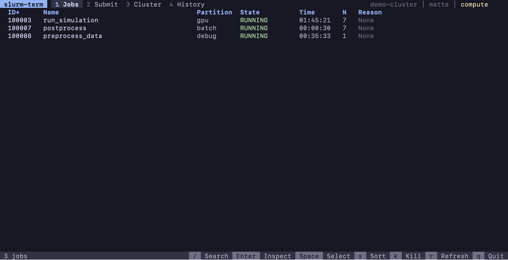
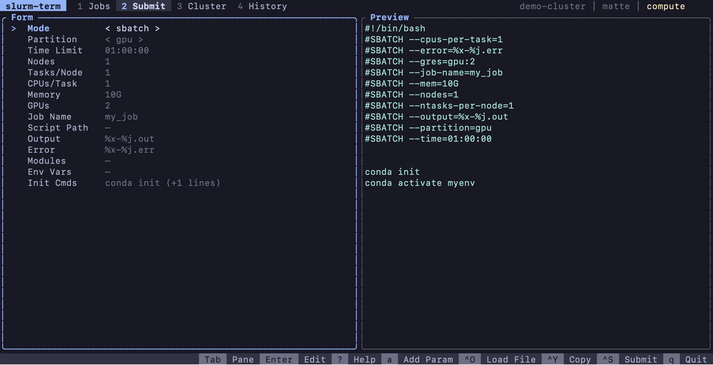

# slurm-term

A keyboard-driven Terminal User Interface for the [Slurm](https://slurm.schedmd.com/) workload manager.

Monitor jobs, compose batch scripts or interactive sessions, explore cluster hardware, and browse job history — all without leaving your terminal.

> From **v0.1.4**: Rewritten in Rust for instant startup, zero runtime dependencies, and a single static binary.




## Features

- **Jobs** — Live job queue with search, selection, bulk cancel/hold/release, and inline inspection
- **Submit** — Interactive job composer with form + preview pane, input validation, parameter catalog with docs (`?`), and `.sbatch` file loading (`Ctrl+O`). In `srun` mode, submitting suspends the TUI and drops you into the interactive session; exit the shell to return
- **Cluster** — Partition and node hardware overview
- **History** — Completed job history with configurable time window
- **Mouse support** — Click to navigate tabs, select jobs, and interact with the form
- **Templates** — Save and load job templates (`Ctrl+T` / `Ctrl+L`)

## Installation

### From PyPI

```sh
pip install slurm-term
```

### From crates.io

```sh
cargo install slurm-term
```

### From source

```sh
git clone https://github.com/22cav/slurm-term.git
cd slurm-term
cargo build --release
# Binary at target/release/slurm-term
```

## Usage

```sh
# Run on a system with Slurm installed
slurm-term

# Load a .sbatch file on startup
slurm-term --file job.sbatch

# Demo mode (mock data, no Slurm required)
slurm-term --demo

# Custom history window
slurm-term --since now-14days
```

## Key Bindings

On macOS terminals that forward it (kitty, WezTerm, Ghostty), `⌘` works as an
alias for `Ctrl`. Terminal.app and iTerm2 keep `⌘` for themselves — use `Ctrl`
there.

### Global

| Key     | Action          |
|---------|-----------------|
| `1-4`   | Switch tab      |
| `q`     | Quit (while not typing) |
| `Ctrl+C`| Quit (always)   |
| `F5`    | Force full redraw + refresh |

### Jobs (Monitor)

| Key     | Action          |
|---------|-----------------|
| `/`     | Search          |
| `j`/`k` | Move down/up    |
| `Enter` | Inspect job     |
| `Space` | Select job      |
| `x`     | Kill selected (with confirm) |
| `h`/`u` | Hold / release  |
| `s` / `S` | Cycle sort column / reverse |
| `r`     | Refresh         |

### Submit (Composer)

| Key      | Action                    |
|----------|---------------------------|
| `Tab`    | Switch form/preview pane  |
| `Enter`  | Edit field (Modules/Env/Init open a multiline editor) |
| `Esc`    | Done editing / back to form |
| `?`      | Parameter help            |
| `a` / `d`| Add / delete extra parameter |
| `Ctrl+O` | Load .sbatch file         |
| `Ctrl+S` | Submit job                |
| `Ctrl+T` / `Ctrl+L` | Save / load template |
| `Ctrl+G` | Copy preview to clipboard |

While editing, standard Emacs-style keys apply: `Ctrl+U` undo, `Ctrl+R` redo,
`Ctrl+K` kill line, `Ctrl+W` delete word, `Ctrl+A`/`Ctrl+E` line start/end.

### Cluster (Hardware)

| Key     | Action          |
|---------|-----------------|
| `Tab`   | Switch view     |
| `s` / `S` | Cycle sort column / reverse |
| `r`     | Refresh         |

### History

| Key     | Action          |
|---------|-----------------|
| `Enter` | Inspect job     |
| `</>`  | Change time window |
| `s` / `S` | Cycle sort column / reverse |
| `r`     | Refresh         |

## Configuration

Configuration is read from `~/.config/slurmterm/config.toml`:

```toml
[poll]
monitor = 3.0
hardware = 30.0
history = 60.0

[general]
history_window = "now-7days"
subprocess_timeout = 30.0   # hard deadline for slurm commands (seconds)

[gpu]
# Opt-in GPU sparkline for the job inspector. Samples utilization on the
# job's first node via `ssh <node> <command>` (BatchMode, 2s connect timeout),
# so passwordless ssh to compute nodes is required.
enabled = false
command = "nvidia-smi"
```

Override the config path with `SLURMTERM_CONFIG=/path/to/config.toml`.

## License

MIT
